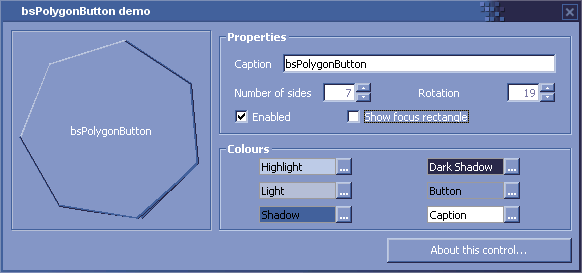



## bsPolygonButton

### Description

Replacing the nasty bsOctControls is the latest in BadSoft tomfoolery - the bsPolygonButton. This control will let you create a 3D button with between 3 and 100 sides, with customisable colours.

For more UserControls please visit http://www.badsoft.co.uk/activex
 
### More Info
 
The DrawEdge API wasn't used in this control because it requires a lot of calculation to draw diagonal controls. Also, it doesn't draw diagonal lines properly anyway. :(

             |
---                |---
**Submitted On**   |2003-11-09 20:41:34
**By**             |[Headdy](https://github.com/Planet-Source-Code/PSCIndex/blob/master/ByAuthor/headdy.md)
**Level**          |Advanced
**User Rating**    |5.0 (10 globes from 2 users)
**Compatibility**  |VB 6\.0
**Category**       |[Custom Controls/ Forms/  Menus](https://github.com/Planet-Source-Code/PSCIndex/blob/master/ByCategory/custom-controls-forms-menus__1-4.md)
**World**          |[Visual Basic](https://github.com/Planet-Source-Code/PSCIndex/blob/master/ByWorld/visual-basic.md)
**Archive File**   |[bsPolygonB16702311102003\.zip](https://github.com/Planet-Source-Code/headdy-bspolygonbutton__1-49796/archive/master.zip)

